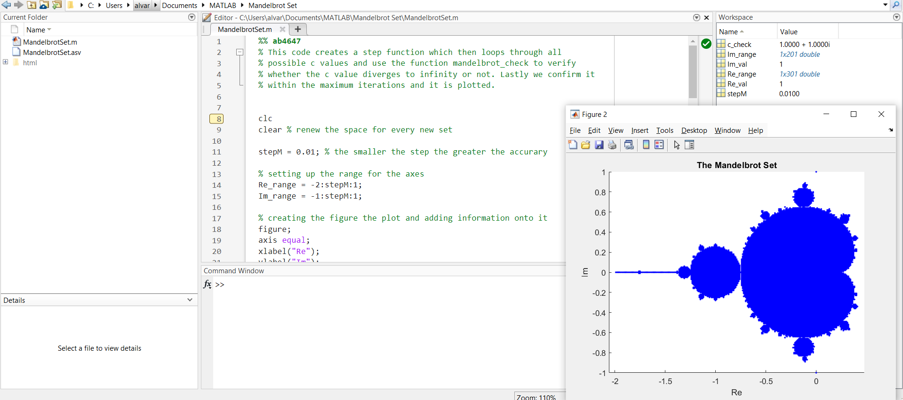

# 🌀 Mandelbrot Set Visualizer (MATLAB)

This MATLAB project generates and plots the **Mandelbrot Set** by iterating over a grid of complex numbers and checking for divergence using a custom function.

> 🧠 _"This code creates a step function which then loops through all possible c values and uses the function `mandelbrot_check` to verify whether the c value diverges to infinity or not. Lastly we confirm it within the maximum iterations and plot it."_  
> — ab4647

---

## ✨ Features
- Grid-based real & imaginary axis sweep  
- 500-iteration check for set membership  
- Plots all non-divergent points in blue on a complex plane  
- Fully annotated with personal comments and logic reasoning

---

## 🖼️ Output Example

  
Generated using `stepM = 0.01` and a 500-iteration cutoff

---

## 🚀 How It Works

1. **Grid Construction**  
   Real values from -2 to 1, imaginary from -1 to 1, in 0.01 steps.

2. **Mandelbrot Check Function**  
   For each `c = Re + Im*i`, apply `z = z^2 + c` up to 500 times.

3. **Plotting**  
   If `z` doesn’t escape (magnitude stays under 2), the point is considered in the set and plotted with `plot()`.

---

## 🧠 Key Learnings

- Improved understanding of complex numbers & iteration stability  
- Hands-on practice with MATLAB graphics and loops  
- Reinforced logic structuring and algorithmic filtering (divergence detection)

---

## 🛠️ How to Run

1. Open `mandelbrot.m` in MATLAB.
2. Hit **Run**.
3. Adjust `stepM` and `maxIterations` if you want higher fidelity or faster computation.

---

## 📁 Files Included

- `mandelbrot.m` – Main script with full logic and personal comments
- `screenshot.png` – Output visualization
- `README.md` – You’re here

---

Made with focus, caffeine, and MATLAB R2024b.
