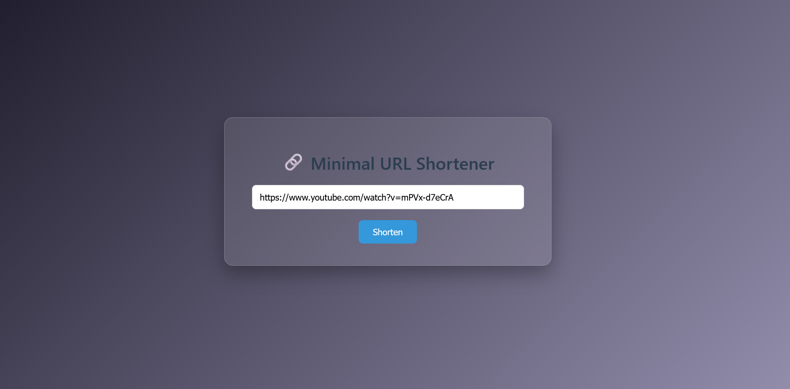
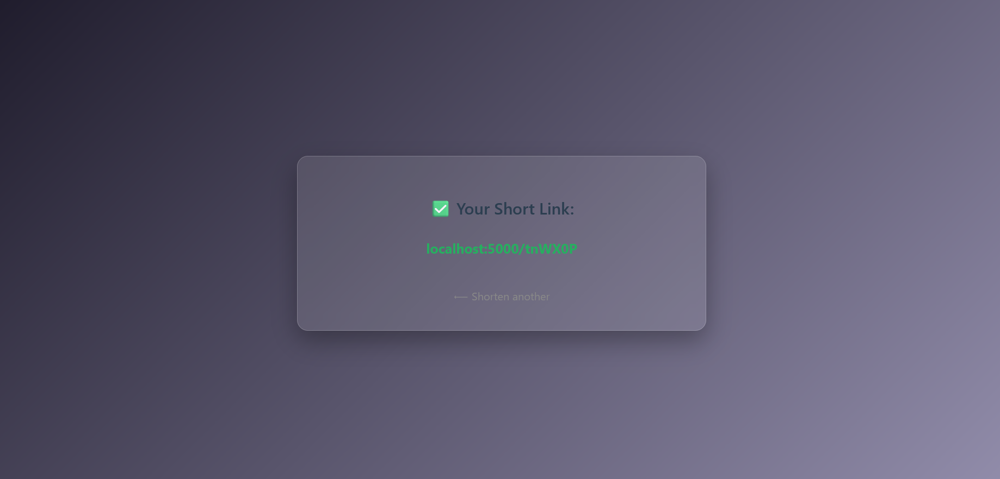

# 🔗 Minimal URL Shortener

A beautifully simple Flask app that converts long URLs into short, clean links — with smooth animations, glassmorphism UI, and full client-side interactivity.

---

## ✨ Features

- 🔥 Built with Flask, HTML & CSS (no frameworks)
- 🎨 Clean, responsive UI with blurred card & gradient background
- 🌀 Animated logo, buttons, and transitions
- 🚀 Instant short link generation and redirection

---

## 📸 Demo

Paste a long URL...



Get a short, clickable link back...



---

## 🗂 Project Structure

```
02-url-shortener-python/
├── app.py
├── README.md
├── templates/
│   ├── index.html
│   └── result.html
├── static/
│   └── style.css
├── screenshots/
│   ├── index-form.png
│   └── short-result.png
```

---

## 🧪 Run Locally

```bash
pip install flask
cd (into correct directory)
python app.py
```

Then visit:  
`http://localhost:5000`

---

## 🌍 Hosting Options

This app works great with:

- ✅ [Replit](https://replit.com) (live preview, easy CSS edits)
- ✅ [Render](https://render.com) (free hosting + custom domain)
- ✅ Localhost (for development)

---

## 👤 Author

Everything in this project — backend logic, Flask routes, HTML, routing and shortener logic — was built from scratch by **Alvaro B.**  
The UI design and animations were custom, with styling suggestions assisted by an LLM. Core functionality is fully original.

---
